# Shutter-up!
Where photographers share their images.

## Motivation
What motivated me to make this app was that there are a lot of platforms for people to share pictures that they take, but very few where photographers, from all expertise levels, can share their images. Additionally, this will allow photographers to share feedback or give advice on how to better the image.

## Screenshots
* 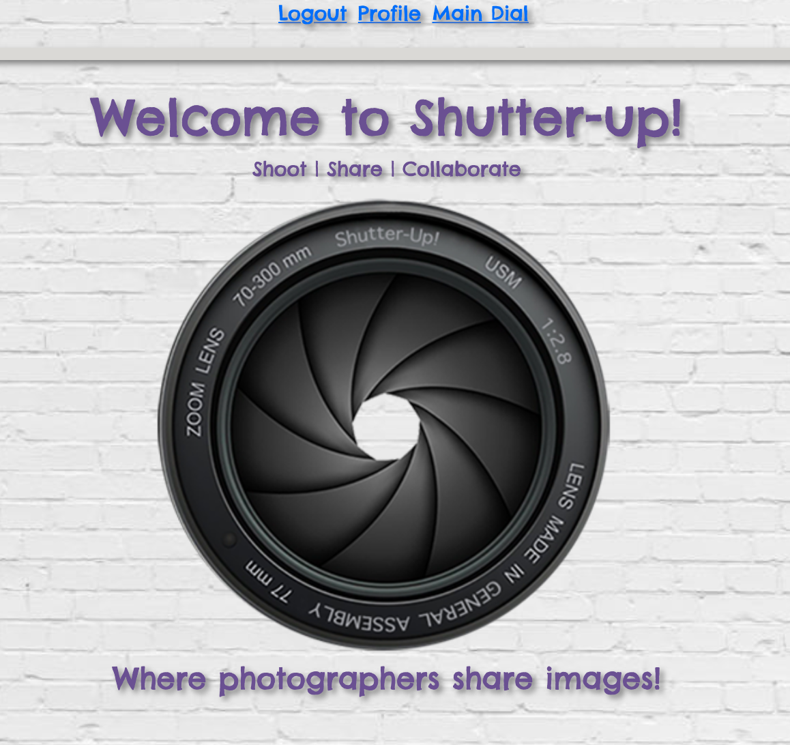
* 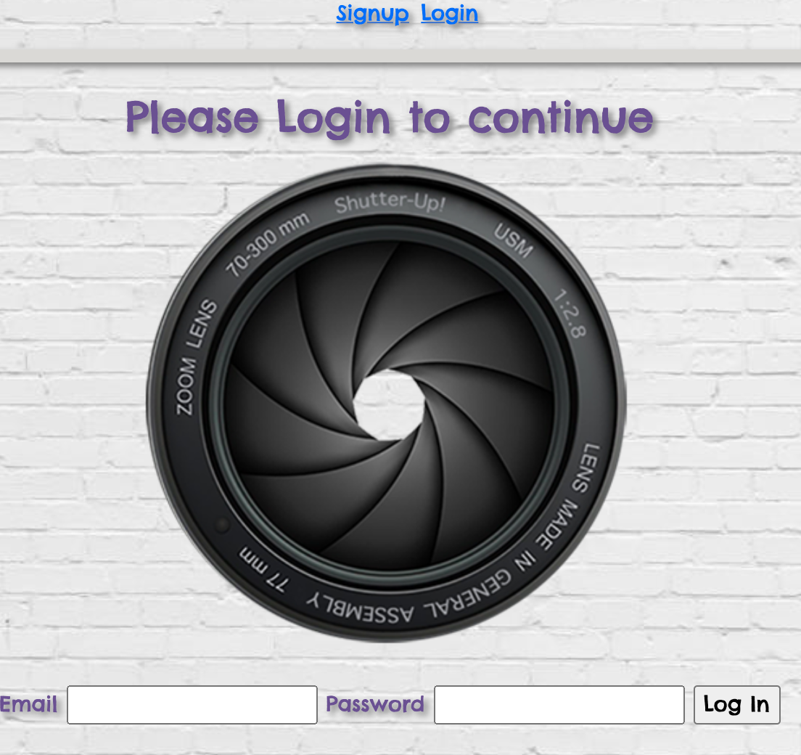
* 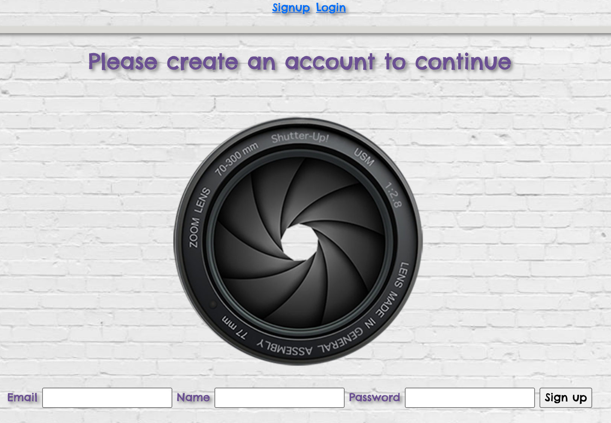
* 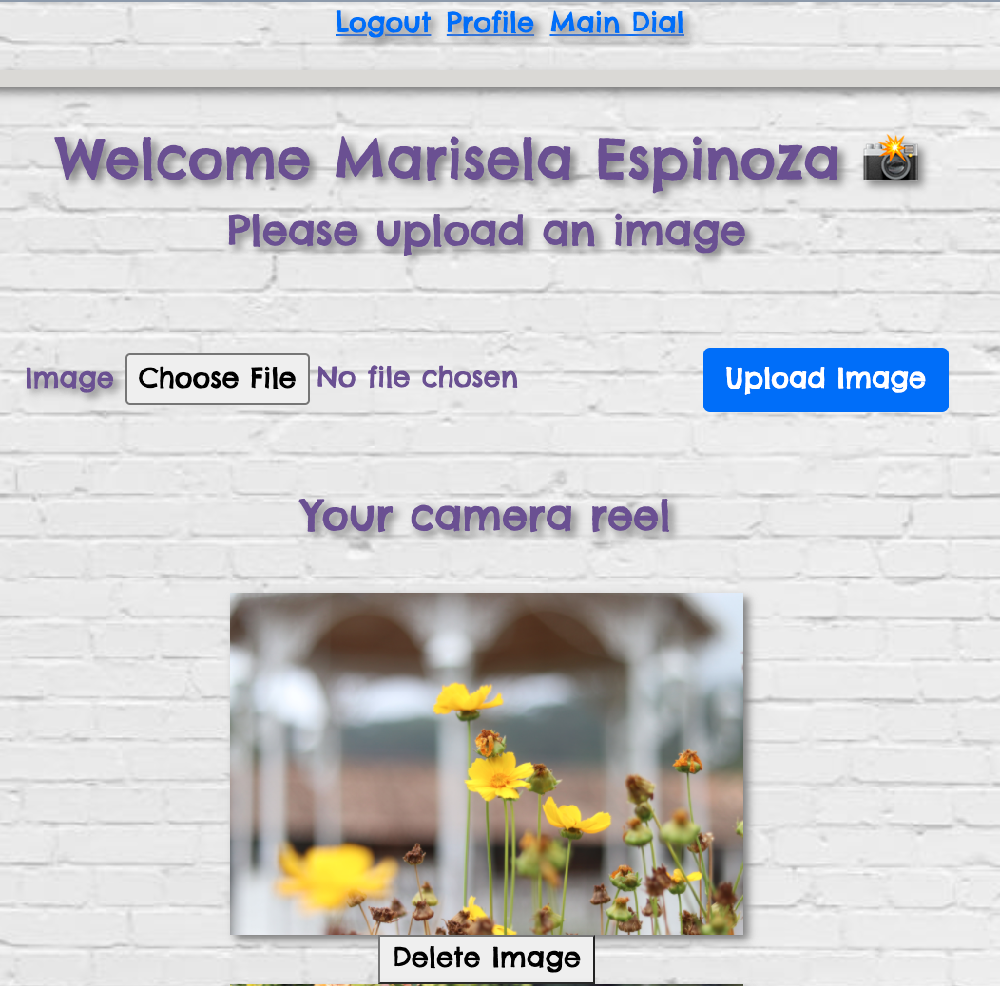
* 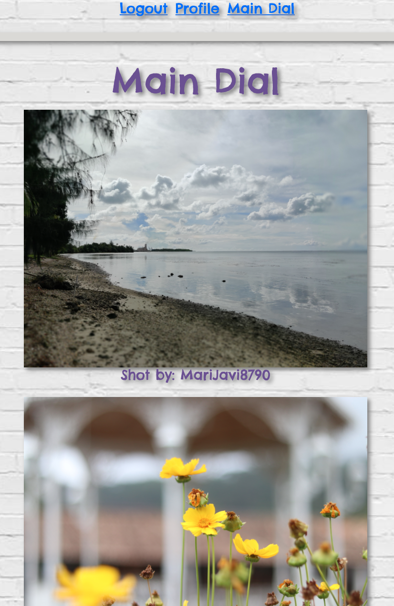
* 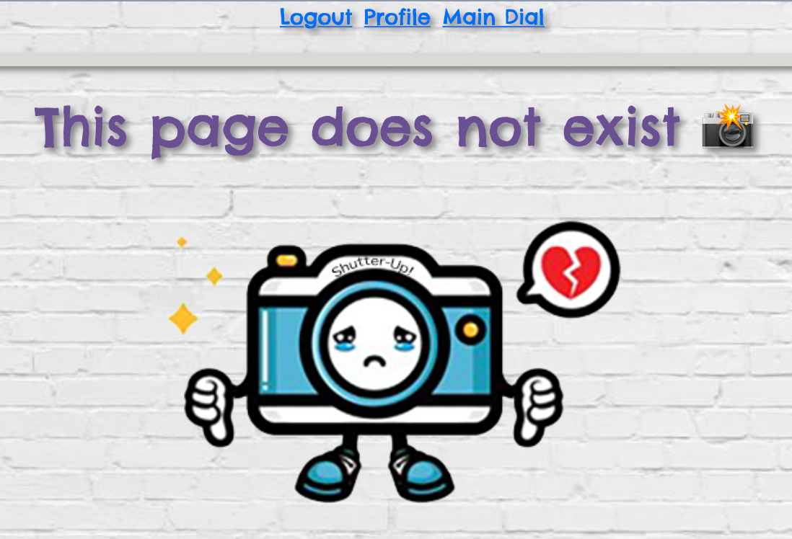

## User Stories & Wireframes
The planning materials used to build this app.

Image 1
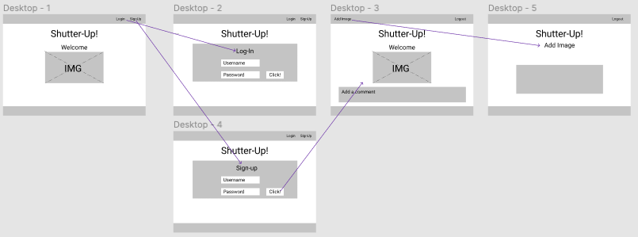

Image 2
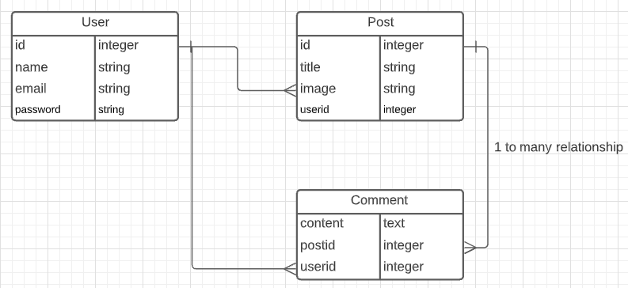

## Technologies & Code Snippets
list of technologies
* JavaScript
* Express
* Node
* Sequelize
* Postgres
* Cloudinary
* Heroku

* 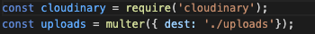
* 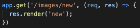
* 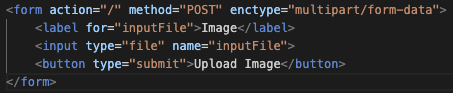
* 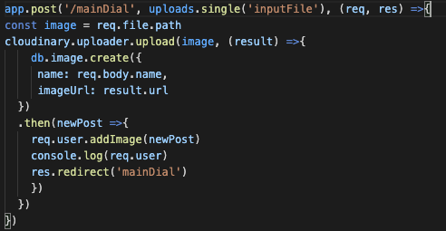
* 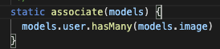
* 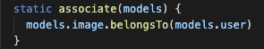

## Credits
* James Sinkler

* Nick Schmitt

* Brian Krabec

* Diego Espinoza

## Future development
In the future I would like to add a comment box where users can add comments on the images posted. I would also like to add a text box so when the user uploads an image they can add a description of it.